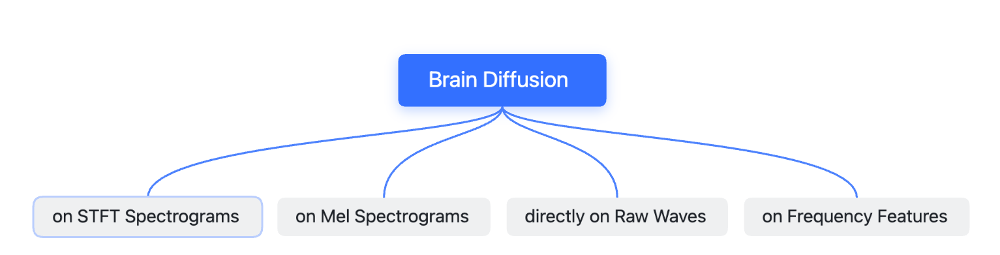

<div align="center">


# Generating Brain Waves with Text
**A Diffusion Framework for Dynamics/EEG Signals Synthesizing or Denoising**

______________________________________________________________________

 []()
[](https://github.com/duanyiqun/DiffusionDepth/blob/main/LICENSE)


</div> 


While existing research has explored translating EEG waves into comprehensible language, the reverse - synthesizing brain waves from textual inputs - remains largely unexplored. The intuition is simple yet interesting, just translating text into brain waves. We are trying to simulate brain dynamics by introducing stable diffusion-formation model into brain waves. 

However, unlike the images, we can't intuitively perception the resonality of the generative quality by human instinction. So currently, this is just an open-demo for fun discussions. There has not been any quantitative evaluation yet.
______________________________________________________________________
  

## Installation

Please install required pip packages
```ssh
pip install transformers==4.27.1
pip install diffuser 
```
If warning of any unfound versions , just install the latest version with conda. Also recommend to use newer version of transformers 


```sh
git clone https://github.com/duanyiqun/Brain-Diffusion.git
cd Brain-Diffusion
pip install -e .
pip instlal -r requirements.txt
```

<div align="left">

## Synthesizing Methods

There are multiple ways to analyze the synthesizing brain waves, we provide a simple mindmap to show the difference between them.

</div>

<div align="center">

</div>

- **STFT Spectrogram** is the most common way to analyze the brain waves. This way is easier to observe spectrogram in natural bands (alpha, beta, gamma...)
- **Mel Spectrogram** is a way more similar to the way human perceive the sound, however we adjust the frequency to adpat much lower sampling rate of brain waves.
- **Raw Waves** is the most intuitive way to observe the brain waves, however it is hard to observe the resonality of the generative quality by human instinction.
- **Frequency Features** is fast to validate whether the diffusion works normaly( or not having bugs.)


We implemente naive demo for all four approaches. As basically we want raw waves as the final output, for STFT and Mel Sepctrogram, we use the inverse transform to convert back to raw waves. For frequency features, it just used for observing the resonality.


## Catalog:
- [**Base Diffusion**](#base-diffusion-bci-iv-dataset)
  - [x] [**STFT Spectrogram**](#base-diffusion-on-stft-spectrogram)
  - [x] [**Mel Spectrogram**](#base-diffusion-on-mel-spectrogram)
- [**Conditional Diffusion**](#conditional-diffusion-zuco-dataset)
  - [x] [**STFT Spectrogram**](#guided-diffusion-on-stft-spectrogram)
  - [x] [**Mel Spectrogram**](#guided-diffusion-on-mel-spectrogram)
  - [x] [**Frequency Features**](#guided-diffusion-on-frequency-features)

</div>

## Data

We use two datasets for training and testing. 

- BCI-IV dataset: which is a public Motor Imaginary Dataset with 4 classes. We use the dataset to train the unconditional diffusion model.
- ZuCo dataset: which is a public dataset for neural natural language reading. We use the dataset to train the conditional diffusion model. The aim is to reconstruct the brain dynamics from the text.

Please refer to the [Docs for Data Preparation](docs/DATA.md) to excute preprocessing and data preparation.
Both the dataset will be transfered to huggingface dataset format. The dataset will be saved in ```dataset/bci_iv``` and ```dataset/zuco```. The structure would be like:

```sh
.
├── bci_iv
│   ├── spectro_dp
│   │   ├── test
│   │   └── train
│   └── stft_64-28
│       ├── test
│       └── train
└── zuco
    ├── freqmap_8_105_56
    │   ├── dataset_dict.json
    │   └── train
    ├── spectro_dp (mel spectrogram)
    │   ├── dev
    │   ├── test
    │   ├── text_encodings_train.pt
    │   └── train
    └── stft-96-64
        ├── dataset_dict.json
        ├── dev
        ├── test
        └── train
```
To be decided: 
- [ ] Upload the dataset to HuggingFace Dataset.


## Base Diffusion (BCI-IV Dataset)
The training entry scripts:

### Base Diffusion on Mel spectrogram

```bash
accelerate launch --config_file config/accelerate_local.yaml \
scripts/train_unet.py \
    --dataset_name dataset/bci_iv/spectro_dp\
    --hop_length 50 \
    --n_fft 100 \
    --output_dir models/bciiv_mel_64 \
    --train_batch_size 2 \
    --num_epochs 100 \
    --gradient_accumulation_steps 1 \
    --learning_rate 1e-4 \
    --lr_warmup_steps 500 \
    --mixed_precision no \
    --original_shape 22,32,64 \
    --force_rescale 22,32,64 \
```
### Base Diffusion on STFT spectrogram
```bash
accelerate launch --config_file config/accelerate_local.yaml \
scripts/train_unet.py \
    --dataset_name dataset/bci_iv/stft_64-24 \
    --hop_length 93 \
    --output_dir models/bciiv_stft_64 \
    --train_batch_size 2 \
    --num_epochs 100 \
    --gradient_accumulation_steps 1 \
    --learning_rate 1e-4 \
    --lr_warmup_steps 500 \
    --mixed_precision no \
    --original_shape 22,24,64 \
    --force_rescale 22,32,64 \
    --stft
```
If you want use wandb to log metrics on webiste first run init 
```bash
wandb login
```


You can switch between logging in tensorboard or wandb by modify the accelerator config file. The default generator is wandb. The project name could be modified by given additional args ```--wandb_projects```. 
The visualization of the image is saved locally to prevent breaking the training process. The visualization of the training process could be found in modesl/name/visualization file. The saving interval could be modified by ```--save_images_epochs```. 
Here are examples of the visualization nearly end of the training, mainly include the spectrogram, and the reconstructed wave.


<div align="center">
 
</br>
</div>


<div align="left">
</br>

## Guided Diffusion (Zuco Dataset)

</div>
Encode condition text files for training. Here we use Berttokenizer to encode the text. The pretrained model is from [bert-base-uncased](https://huggingface.co/bert-base-uncased).

The encoded text embedding cache will be saved in the output root.
```sh
python scripts/encode_condition.py --input_dir path-to-preprocessed-zuco --output_dir path-to-output-data --task_name task1-SR
```

The current training version support both diffusion on mel spectrogram and STFT spectrogram and raw waves and frequency features. Here I give examples below:

### Guided Diffusion on Mel spectrogram

```sh
  CUDA_VISIBLE_DEVICES=1 accelerate launch --config_file config/accelerate_local.yaml \
  scripts/train_unet_conditioned.py \
      --dataset_name dataset/zuco/condition \
      --hop_length 75 \
      --eeg_channels 105 \
      --n_fft 100 \
      --sample_rate 500 \
      --output_dir models/zuco-mel-test \
      --train_batch_size 2 \
      --num_epochs 100 \
      --gradient_accumulation_steps 1 \
      --learning_rate 1e-4 \
      --lr_warmup_steps 500 \
      --max_freq 64 \
      --original_shape 105,112,96 \
      --force_rescale 105,96,64 \
      --mixed_precision fp16 
  ```
### Guided Diffusion on STFT spectrogram
```sh
CUDA_VISIBLE_DEVICES=1 accelerate launch --config_file config/accelerate_local.yaml \
scripts/train_unet_conditioned.py \
    --dataset_name dataset/zuco/stft-96-64 \
    --stft \
    --hop_length 69 \
    --eeg_channels 105 \
    --n_fft 127 \
    --sample_rate 500 \
    --output_dir models/zuco-stft9664-test \
    --train_batch_size 2 \
    --num_epochs 100 \
    --gradient_accumulation_steps 1 \
    --learning_rate 1e-4 \
    --lr_warmup_steps 500 \
    --mixed_precision fp16
```
### Guided Diffusion on frequency features 
Especially we use the frquency feature used for translation. Basically we want inverse the translation process. 
The features include 8 frequency bands, where the bands are:
```python
'theta_1 (4–6 Hz)', 'theta_2 (6.5–8 Hz)', 'alpha_1 (8.5–10 Hz)', 'alpha_2 (10.5–13 Hz)', 'beta_1 (13.5–18 Hz)', 'beta_2 (18.5–30 Hz)', 'gamma_1 (30.5–40 Hz)', 'gamma_2 (40–49.5 Hz)'
```
However, there are two approaches to apply diffusion on these frequency features.  
1. Apply diffusion by treating the feature map as an image with size 32, 840.
2. Apply diffusion by treating the feature map with each channel representing a frequency band, the input shape is 8, 105, 32. 
Where dimension of 56/32 is the time dimension, 105 is the number of real EEG channels. 
Here great thanks for Dr. [Nora Hollenstein](https://norahollenstein.github.io/) for providing which channels are used in ZuCo dataset (105 channels out of 128 channels).

#### Frequency features with image formation

```sh
CUDA_VISIBLE_DEVICES=0 accelerate launch --config_file config/accelerate_local.yaml \
scripts/train_unet_freq.py \
    --dataset_name dataset/zuco/freqmap_32_840 \
    --hop_length 50 \
    --eeg_channels 1 \
    --n_fft 100 \
    --sample_rate 500 \
    --output_dir models/zuco-freq_map_32_420-630 \
    --train_batch_size 2 \
    --num_epochs 100 \
    --gradient_accumulation_steps 1 \
    --learning_rate 1e-4 \
    --lr_warmup_steps 500 \
    --max_freq 420 \
    --min_freq 630 \
    --original_shape 1,32,840 \
    --force_rescale 1,32,840 \
    --mixed_precision fp16 \
    --debug
```

The biggest problem is the time segments. Given a text, the feature lenggth should be approaximately consistency with the text length. 
We can observe that the consistency becomes better through the training process. Below we show the comparison between the feature map after epoch 9 and the feature map after 99. However, the generated feature length is is still lower than expected. Also the generated clearity of the feature map decreases and tend to be averaged.

<div align="center">
    <div style="display: inline-block;">
        <figure>
            
            <figcaption> Visualization after Epoch 9</figcaption>
        </figure>
    </div>
    <div style="display: inline-block;">
        <figure>
            
            <figcaption>Visualization after Epoch 99</figcaption>
        </figure>
    </div>
</div>
Limited to space I only show feature 0-420 out of 840 dimension of the features. 

#### Frequency features with feature map 8, 105, 56

```sh
CUDA_VISIBLE_DEVICES=1 accelerate launch --config_file config/accelerate_local.yaml \
scripts/train_unet_freq_2d.py \
    --dataset_name dataset/zuco/freqmap_8_105_56 \
    --hop_length 50 \
    --eeg_channels 8 \
    --n_fft 100 \
    --sample_rate 500 \
    --output_dir models/zuco-freq_map_810556_nora \
    --train_batch_size 3 \
    --num_epochs 100 \
    --gradient_accumulation_steps 1 \
    --learning_rate 1e-4 \
    --lr_warmup_steps 500 \
    --max_freq 32 \
    --original_shape 8,105,56 \
    --force_rescale 8,105,56 \
    --mixed_precision fp16 \
    --debug
```
  
If we expand the topomap into static map as below. 

<div align="center">

</br>
</div>